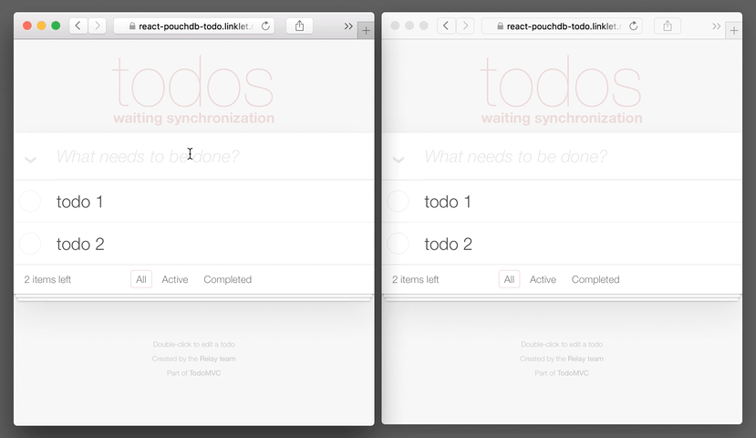

# react-pouchdb-todo example

__[Live Example](https://react-pouchdb-todo.linklet.run)__



## Setup

```bash
npm install
```

## Dev

```bash
npm start
```

__open [http://localhost:3000](http://localhost:3000)__

## Production build

```bash
npm run build
```

## Docker deployment

```bash
docker build -t react-pouchdb-todo .
docker run  -d \
  -p 8080:80 \
  -e ENDPOINT_TOKEN=yourJWToken \
  -e ENDPOINT=https://react-pouchdb-todo.linklet.run/default \
  -e CONFIG_VARS=ENDPOINT,ENDPOINT_TOKEN \
  react-pouchdb-todo
```
